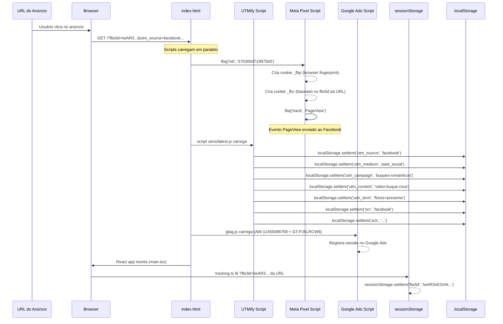
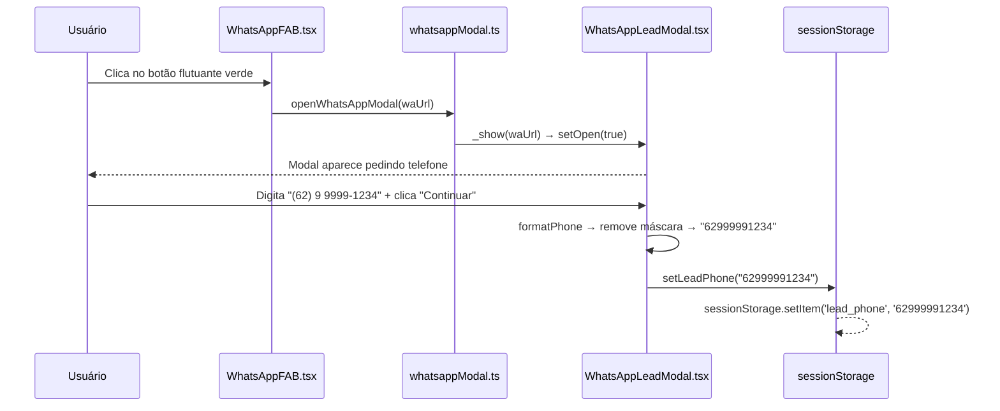
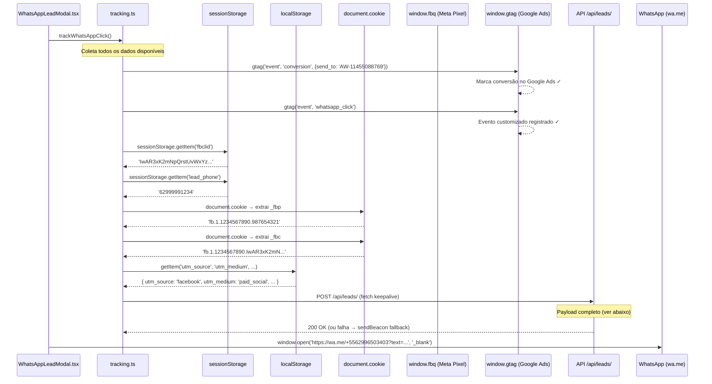
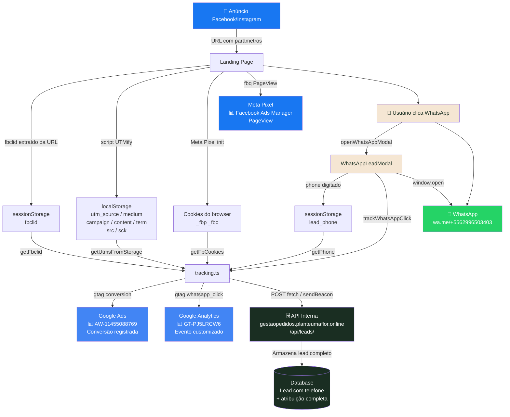
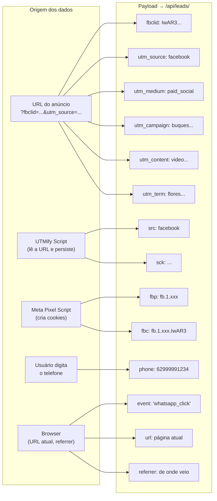
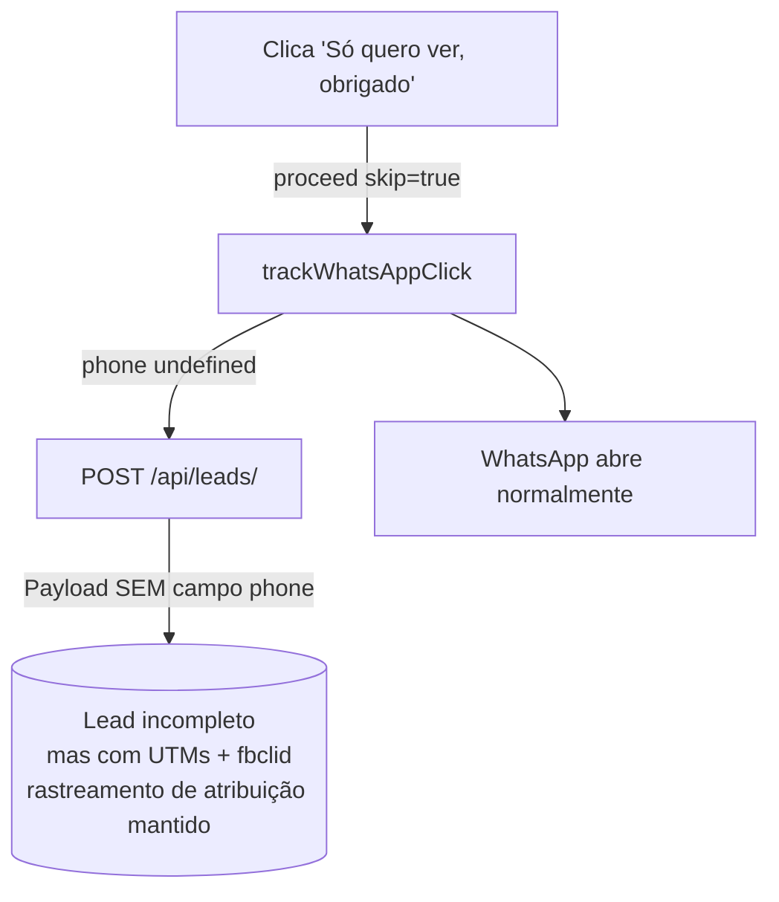
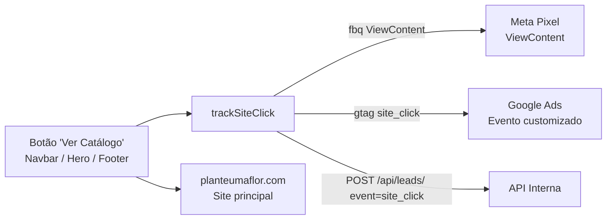

# Fluxo de Dados — Usuário vindo de Anúncio

Simulação completa de uma pessoa que clicou em um anúncio do Facebook/Meta e converteu no WhatsApp.

---

## O Anúncio (ponto de partida)

O usuário vê um anúncio no Instagram e clica. O Facebook gera a URL de destino assim:

```
https://www.planteumaflor.com
  ?fbclid=IwAR3xK2mNpQrstUvWxYz...   ← Facebook Click ID (gerado pelo FB por clique)
  &utm_source=facebook
  &utm_medium=paid_social
  &utm_campaign=buques-romanticos
  &utm_content=video-buque-rosa
  &utm_term=flores+presente
```

---

## Fase 1 — Chegada na Página (Page Load)



### O que está armazenado após o page load:

| Storage | Chave | Valor | Origem |
|---------|-------|-------|--------|
| `sessionStorage` | `fbclid` | `IwAR3xK2mNpQrstUvWxYz...` | URL do anúncio |
| `localStorage` | `utm_source` | `facebook` | UTMify |
| `localStorage` | `utm_medium` | `paid_social` | UTMify |
| `localStorage` | `utm_campaign` | `buques-romanticos` | UTMify |
| `localStorage` | `utm_content` | `video-buque-rosa` | UTMify |
| `localStorage` | `utm_term` | `flores+presente` | UTMify |
| `localStorage` | `src` | `facebook` | UTMify |
| `cookie` | `_fbp` | `fb.1.1234567890.987654321` | Meta Pixel (gerado) |
| `cookie` | `_fbc` | `fb.1.1234567890.IwAR3xK2mN...` | Meta Pixel (do fbclid) |

---

## Fase 2 — Usuário navega e clica no WhatsApp



---

## Fase 3 — Disparo de Tracking (o momento crítico)



---

## Payload Completo enviado à API

```json
{
  "event":        "whatsapp_click",
  "url":          "https://www.planteumaflor.com/?fbclid=IwAR3xK2mN...&utm_source=facebook&...",
  "referrer":     "https://www.instagram.com/",
  "fbclid":       "IwAR3xK2mNpQrstUvWxYz...",
  "fbp":          "fb.1.1234567890.987654321",
  "fbc":          "fb.1.1234567890.IwAR3xK2mNpQrstUvWxYz...",
  "phone":        "62999991234",
  "utm_source":   "facebook",
  "utm_medium":   "paid_social",
  "utm_campaign": "buques-romanticos",
  "utm_content":  "video-buque-rosa",
  "utm_term":     "flores+presente",
  "src":          "facebook",
  "sck":          "..."
}
```

---

## Grafo de Destinos dos Dados



---

## Grafo de Origem de Cada Campo



---

## Linha do Tempo (timeline)

```mermaid
gantt
    title Linha do tempo de um lead (t=0 = clique no anúncio)
    dateFormat  X
    axisFormat %ss

    section Page Load
    Usuário chega na página         :milestone, 0, 0
    UTMify salva UTMs no localStorage :active, 0, 1
    Meta Pixel cria cookies _fbp _fbc :active, 0, 1
    tracking.ts salva fbclid no sessionStorage :active, 0, 1
    fbq PageView enviado ao Facebook  :milestone, 1, 1

    section Engajamento
    Usuário rola a página            :2, 15
    Usuário clica no FAB WhatsApp    :milestone, 15, 15

    section Conversão
    Modal de captura abre            :15, 16
    Usuário digita telefone          :16, 25
    Usuário clica "Continuar"        :milestone, 25, 25
    phone salvo no sessionStorage    :25, 25
    trackWhatsAppClick() dispara     :25, 25
    gtag conversion → Google Ads     :25, 26
    POST /api/leads/ enviado         :25, 26
    WhatsApp abre em nova aba        :milestone, 26, 26
```



---

## Caso especial: Usuário clica "Só quero ver"

Se o usuário pular o modal sem digitar telefone:



O lead ainda é rastreado — apenas sem o telefone. Os dados de atribuição do anúncio (UTMs, fbclid, fbp, fbc) continuam sendo enviados.

---

## Evento "Ver Catálogo" (trackSiteClick)

Quando o usuário clica em "Ver Catálogo" em vez de WhatsApp:



---

## Resumo de Destinos

| Dado | sessionStorage | localStorage | Cookie | Meta Pixel | Google Ads | API /api/leads/ |
|------|:-:|:-:|:-:|:-:|:-:|:-:|
| `fbclid` | ✅ | | ✅ (_fbc) | | | ✅ |
| `utm_source/medium/...` | | ✅ | | | | ✅ |
| `_fbp` | | | ✅ | ✅ (gerado) | | ✅ |
| `_fbc` | | | ✅ | ✅ (gerado) | | ✅ |
| `phone` | ✅ | | | | | ✅ |
| `PageView` | | | | ✅ | | |
| `Contact` | | | | ✅ | | |
| `ViewContent` | | | | ✅ | | |
| Conversão WA | | | | | ✅ | ✅ |
| `src` / `sck` | | ✅ | | | | ✅ |

---

## Pontos de Atenção

**fbclid só vive na sessão** — se o usuário fechar e reabrir o browser, o `fbclid` some do `sessionStorage`. O cookie `_fbc` persiste mais tempo (gerado pelo Meta Pixel).

**UTMs vivem no localStorage** — sobrevivem a fechar/abrir o browser. Cuidado: uma segunda visita por outro canal pode sobrescrever as UTMs do anúncio original se o UTMify não tiver lógica de "first touch".

**fetch com fallback sendBeacon** — se o `fetch` falhar (conexão instável no mobile), o `sendBeacon` dispara. O `sendBeacon` não garante ordem de chegada, mas garante entrega mesmo após o browser fechar a aba.

**Dois listeners de clique WhatsApp no index.html** — um abre o link (trusted click), outro dispara o `fbq Contact`. São independentes do modal React.
